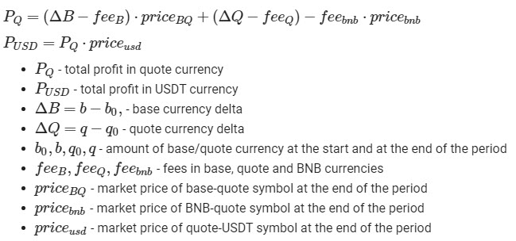

# Binance trading performance
Trading profit/loss calculation on Binance spot market

Formulas for performance calculation:

This calculation is based upon hummingbot perfomance measuring: 
https://hummingbot.io/blog/2019-07-measure-performance-crypto-trading/

Credits for Binance api to [@Bablofil](https://github.com/Bablofil/binance-api)
